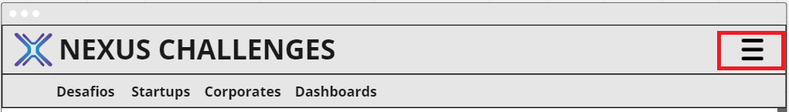

# Interação Humano Computador
[<< Menu](../README.md)

## **Inspection Evaluation**

## **Visibilidade do Estado do Sistema**
### **1:** O menu horizontal está sendo subutilizado quanto a representação do estado do sistema
**Avaliação:** 1  
**Sugestão:** Destacar no menu horizontal, em qual seção do site o usuário se encontra

  

## **Correspondência entre o Sistema e o Mundo Real**
### **1:** Na “Listando os Desafios”, o modo que os desafios são filtrados me parecem um pouco confuso com os termos “Aberto” e “Fechado” de “Tipos” e os termos “Em aberto” e “Realizado” de “Match”
**Avaliação:** 1  
**Sugestão:** Usar “Nichado” e “Não nichado” para “Tipos” talvez seja mais simples ou “Pendente” e “Realizado” para “Match” assim pode ser que seja mais fácil de visualizar quais empresas ainda precisam ser combinadas com as corporates.

  

## **Liberdade e Controle do Usuário**
### Tabelas e formulários possuem ferramentas claras para edição e exclusão de entradas, adicionalmente, caixas de confirmação são munidas de um botão de cancelamento.
**Avaliação:** 0

## **Consistência e Padrões**
### **1:** Existe um problema durante a criação de novos desafios, a partir da tela “Listando os Desafios”, não existe a opção para a criação de um desafio novo, apesar da presença de uma tela de “Cadastro de Desafios”.
**Avaliação:** 2  
**Sugestão:** Adicionar um botão em “Listando os Desafios” que leva à “Cadastro de Desafios”

  
  

### **2:** Na tela de cadastro de startup temos o campo “Eixo” e na de listagem é “Área”. Se realmente forem campos diferentes, então faltou esse campo na tela de cadastro da startup. O mesmo acontece para os campos “Equipe” e “Número de Funcionários”. Além disso, não existe campo de faturamento na tela de cadastro.

**Avaliação:** 2  
**Sugestão:** Manter os dois labels com o mesmo nome, ou incluir os campos faltantes no cadastro de startup.

  
  

### **3:** Na tela de cadastro da Corporate não existe campo “Maturidade”, porém existe o filtro na tela de listagem. Realmente precisa ter a maturidade da Corporate? Além disso, o que o campo "número de desafios" significa?
**Avaliação:** 2  
**Sugestão:**  Incluir “Maturidade” no cadastro ou retirar do filtro. Caso o campo "número de desafios" apenas mostra a quantidade de desafios que aquela corporate já criou, então o campo deveria estar "bloqueado", pois o usuário não pode digitar.

  
  

### **4:** Esse item é um botão para realizar a busca ou é um filtro? Além disso, o texto da ação está em inglês, e todo o restante está em português.
**Avaliação:** 1  
**Sugestão:**  Se for um botão para realizar a busca, então diminuir o espaçamento entre o texto e o ícone para não dar a entender que é um campo para digitar. Além disso, trocar o texto para “Pesquisar”.

  

### **5:** Design de filtro diferente.
**Avaliação:** 1  
**Sugestão:**  Padronizar.

  

### **6:** Botão sem utilização.
**Avaliação:** 1  
**Sugestão:** Retirar o botão ou adicionar funcionalidades.

  

### **7:** Popup de nova fase não segue os padrões.
**Avaliação:** 1  
**Sugestão:** Refazer o design seguindo os padrões, mantendo cinza.

  
  

### **8:** Não foi possível entender o sistema de fases.
**Avaliação:** 4   
**Sugestão:** Refazer o design para que os dados da fase apareçam na tela de cadastro de desafio ou refatorar essa função.

  

## **Prevenção de Erro**
### Cada ação relevante tomada pelo usuário é acompanhada de uma caixa de confirmação.
**Avaliação:** 0

## **Reconhecimento em vez de lembrança**
### **1:** “Maturidade” na tela de cadastro de Startup deveria ser um listBox para informar ao usuário quais as opções de maturidade.
**Avaliação:** 2  
**Sugestão:** Incluir as opções do campo.

  

## **Flexibilidade e eficiência de uso**
### Por ser um protótipo de baixa fidelidade, isso não foi apresentado pelos desenvolvedores.
**Sugestão:** Seria interessante saber no protótipo de alta como o usuário interage na página e tentar entender como funcionam os botões, para assim saber se o usuário teria problemas.

## **Estética e design minimalista**
### **1:** Os filtros aparentes podem poluir o design já que possuem muitos campos, podendo desviar a atenção do usuário.
**Avaliação:** 1  
**Sugestão:** Colocar um botão para mostrar/minimizar os filtros.

  

## **Ajuda o usuário a reconhecer, diagnosticar e recuperar de erros**
### Por ser um protótipo de baixa fidelidade, isso não foi apresentado pelos desenvolvedores.
**Sugestão:** Colocar nas próximas versões caso tenha partes do sistema que possam conter erros para os usuários.

## **Ajuda e documentação**
### **1:** O que o seguinte botão faz? Aumenta o máximo? Em quantas unidades?
**Avaliação:** 2  
**Sugestão:** Retirar o botão ou incluir algum label que indique sua função.

  

### **2:** Os campos "Faturamento" e "Tamanho da equipe" em "Cadastro de Desafio" indicam a quantidade exata de faturamento/tamanho da equipe que a Startup deve ter? Ou é o mínimo requerido?
**Avaliação:** 2  
**Sugestão:** Adicionar o texto “Faturamento” e "Tamanho da Equipe” como labels e dentro da caixa de texto indicar “mínimo/máximo”, ou criar duas caixas de texto, como nos filtros.

  

### **3:** Na tela “Dashboard” poderia ter uma definição de período, seriam dias, semanas, meses, anos?
**Avaliação:** 2
**Sugestão:** Explicitar como o usuário deve fornecer os dados do período através de máscara no campo ou label.

  

