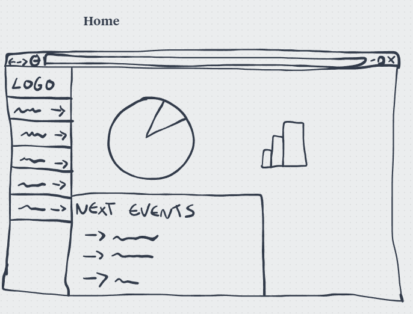

# Interação Humano Computador
[<< Menu](../README.md)

## **Low Fidelity Prototype**

### **Funcionalidades**

* Centralização de dados: Espera-se que todos os dados do processo de acompanhamento sejam centralizados na plataforma. Dessa forma os usuários terão fácil acesso.
* Inserção de relatórios: Os relatórios gerados pelos consultores devem ser inseridos na plataforma para que sejam interpretados.
* Geração de indicadores: Com os dados dos relatórios, o usuário poderá criar gráficos indicadores para interpretar as informações.
* Controle de agendas: Os usuários poderão marcar reuniões e notificar as Startups sobre pendências pelo sistema.
* Visualização de histórico: Os dados inseridos devem ser íntegros e a cada vez que um novo acompanhamento for feito, os dados antigos devem continuar acessíveis.
* Consulta fácil: Os usuários devem conseguir, facilmente, utilizar filtros para consultar dados de empresas.
* Padronização de dados de entrada.

### **Telas**
* Home
* Lista de empresas (Com filtragem + visualizações customizadas)
* Detalhes da empresa (Histórico)
* Agenda (Com filtragem)
* Conexões (Com filtragem)

### **Sketches**
#### **Sketch 1**

  

#### **Sketch 2**

  

#### **Sketch 3**

  
  

#### **Sketch 4**

  
  
  
  
  

### **Low Fidelity Prototype**
https://www.figma.com/file/sVDlSrqm73rlrxxqQ1MvXV/IHC?node-id=0%3A1

  
  
  
  
  
  
  
  
  
  
  
  

