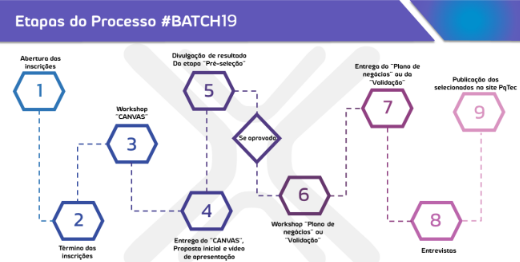

# **Relatório de Research**

## **(a) uma descrição sucinta de sua ideia de projeto, como você espera que seu sistema seja usado, por quem e o contexto em que você espera que ele seja usado**

O projeto consiste em desenvolver uma plataforma web para gerenciar o crescimento de startups em programas de aceleração. Espera-se que o sistema seja utilizado no dia a dia dos empregados da Nexus com o objetivo de otimizar seu serviço ao manter os dados coletados durante os acompanhamentos centralizados, de fácil acesso e interpretação das informações.

## **(b) fornecer uma lista de interessados ​​e descrevê-los no que se refere ao projeto do sistema;**

Os interessados no projeto são compostos por:

- **Time do Nexus:** Os principais usuários do sistema. Através dele os empregados vão inserir relatórios, gerar indicadores e organizar suas tarefas.
- **Consultores:** Fazem parte do processo de acompanhamento. Os relatórios gerados por eles serão armazenados e interpretados pelo sistema.
- **Startups:** Pequenas empresas que terão seus dados analisados. No sistema estarão centralizados todos os dados de seu período de incubação. 
- **Empresas parceiras:** Companhias que fazem conexão com as Startups por meio do Nexus. Influenciam diretamente no processo de crescimento da Startups por meio de parcerias.

## **(c) discutir os métodos de pesquisa do usuário que você usou, fornecer justificativa para eles e fornecer um resumo de suas descobertas de cada um desses métodos;**

`	`**Desk Research:** Utilizamos o desk research para procurar informações sobre o processo de incubação das Startups no Nexus com o objetivo de conhecer o processo seletivo. Com o Desk Research poderíamos entender sobre o projeto do Nexus sem precisar nos conectar com nenhuma pessoa da equipe, apenas consultando a documentação do programa. Descobertas:

- O Nexus conta com seis programas de aceleração: Lab, Growth, Scale Up, PD&I, Corp e Base. E o foco de nosso projeto é o acompanhamento no programa Nexus Growth. https://pqtec.org.br/nexus/
- O Nexus Growth é dividido em dois: Tech e Digital. Os dois têm como objetivo consolidar o modelo de negócios, porém o Tech é dedicado às startups que inovam por meio de desenvolvimento tecnológico (hardware, produtos físicos). Já o Digital voltado para quem atua com modelos de negócio inovadores (software, prestações de serviços digitais). <https://pqtec.org.br/nexus/nexus-startups/#nexus-growth>
- Os dois projetos possuem o mesmo edital, e o processo de seleção é o mesmo. 

  

<https://pqtec.org.br/download/selecao-nexus-startups-019-2022-1o-semestre/>

**Interview:** Depois de coletar informações com o desk research, fizemos uma entrevista com a Bárbara, do time do Nexus, com o objetivo de tirar dúvidas e entender mais profundamente sobre o projeto. Com a entrevistas, tivemos diversas descobertas:

- O Nexus Growth Digital tem reuniões bimestrais, pois o acompanhamento é pelo desenvolvimento de softwares e serviços. Já o Tech trimestral, pois como acompanha um desenvolvimento físico de produtos, leva mais tempo.
- A equipe do Nexus tem um modelo pronto para a análise das Startups. Para as empresas do Digital, o MAIA, e do Tech o MAEI.

- Os consultores que geram os relatórios são terceirizados. Porém utilizam os modelos da Nexus descritos acima.
- A partir das análises dos consultores são feitas as conexões, isto é, órgãos e empresas que as Startups devem entrar em contato para seu desenvolvimento.
- A maior dificuldade deles é centralizar todo o histórico de cada projeto em um só portal.
- Hoje eles utilizam uma plataforma, mas somente para a inscrição das Startups, a partir desta, é composta uma planilha e diretórios locais, que servem para o acompanhamento posterior.

- Para o novo projeto, é importante ter: informações centralizadas, histórico de crescimento, entregas das startup, alertas e lembretes para as startups marcarem reuniões (devolutivas) com os consultores.
- Conexões: são todos os envolvimentos (outras Startups, consultores, investidores, etc) que a Startup tem durante o Nexus.

## **(d) reflita sobre seu uso dos métodos -- o que deu certo, o que deu errado e o que você faria diferente**

O uso dos métodos foi bom e nos trouxe muitas respostas. Gravando a reunião temos “anotações em tempo real” e qualquer dúvida podemos consultar novamente esse registro. Porém se fosse para fazer algo diferente, faríamos uma reunião mais longa e com mais pessoas envolvidas. Como a Bárbara tinha tempo limitado, separamos as perguntas com antecedência e não podíamos nos estender muito em algum assunto. Além disso, a visão dela sobre como as Startups desfrutam do Nexus é enviesada, gostaríamos que tivesse uma pessoa representante das Startups na reunião. 

O Desk Research foi mais complexo de ser feito, começamos pelo próprio site da Nexus, porém não obtivemos muitas informações, passamos então para o edital de seleção para nos dar algumas informações e em seguida procuramos por outros centros de inovação e incubação para saber como o sistema deles funcionava. Com a entrevista pedimos imagens do sistema atual deles para sabermos como está agora e o que vale a pena mudar ou não.

## **(e) forneça de 6 a 8 descrições de tarefas de como você espera que o sistema seja usado.**

- Centralização de dados: Espera-se que todos os dados do processo de acompanhamento sejam centralizados na plataforma. Dessa forma os usuários terão fácil acesso.
- Inserção de relatórios: Os relatórios gerados pelos consultores devem ser inseridos na plataforma para que sejam interpretados.
- Geração de indicadores: Com os dados dos relatórios, o usuário poderá criar gráficos indicadores para interpretar as informações.
- Controle de agendas: Os usuários poderão marcar reuniões e notificar as Startups sobre pendências pelo sistema.
- Visualização de histórico: Os dados inseridos devem ser íntegros e a cada vez que um novo acompanhamento for feito, os dados antigos devem continuar acessíveis.
- Consulta fácil: Os usuários devem conseguir, facilmente, utilizar filtros para consultar dados de empresas.
- Padronização de dados de entrada
